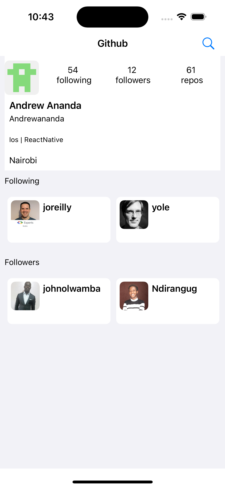

## Github Users Api
	
	Screenshorts
		  
		  
		 


### Clone
git clone https://github.com/Andrewananda/GitUsers.git


### Prerequisites
Before runing the application, you first need to add your Github Personal Access Token, to Utilities/Constants

```yaml
token="xxxx-xxxx-xxx"
```

### Project Goal

* Search for a user profile on Github and display his account details, including, but not limited, to image, bio, username, and full name.

* Have the ability to display the user followers, and following lists. (the accounts that the user is following, and the accounts that are followed by the selected user)


### Tests
	Github users unit tests

<!--	 -->
	 
